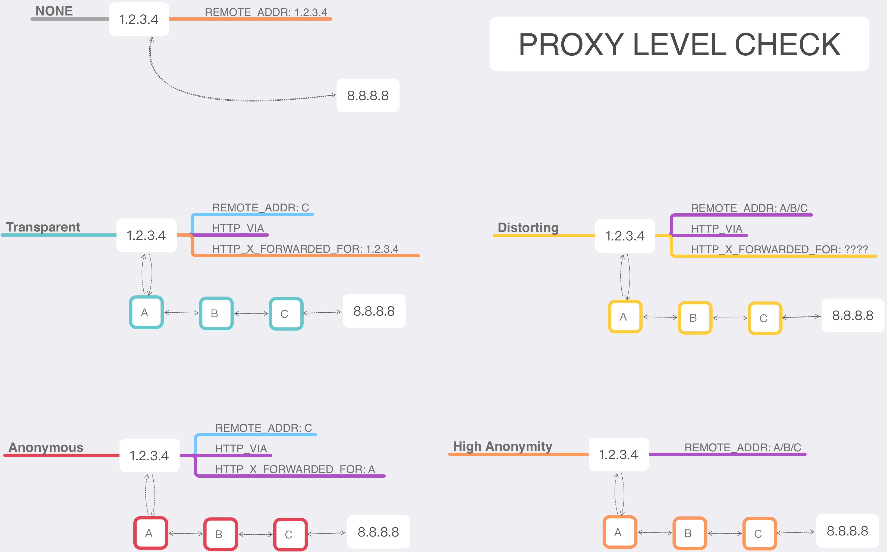
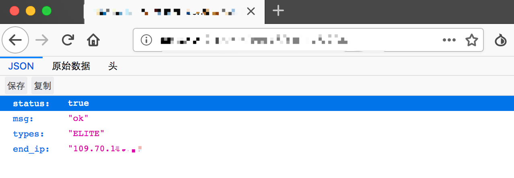

<h1 align="center">代理匿名检测</h1>

<p align="center">
    
    
    <a href="https://github.com/aoii103/proxy_checker/blob/master/LICENSE">
        
    </a>
</p>

>📖[En_Doc](README_en.md)

这是一款配合中间件组合处理的代理检测工具。

### ✨ 原理图



### python环境配置

下载并安装 *`anaconda 3.5`*

```
pip install -r ./requirements.txt
pip install -U 'requests[socks]'
```

### 🚀 启用服务

> ⚠️ 请将conf_dev.py 改为 conf.py

将文件代码上传到服务器上并修改`conf.py`的`IPs.SERVER`参数为该服务器的外网IP

```python
class IPs(Enum):
    CLIENT = "A.B.C.D"
    SERVER = "A.B.C.D"

```
并运行`bash start.sh`命令来启动`Caddy`及`server`服务

### 测试

现在我们通过洋葱浏览器访问 `http://[server_ip]/client=B.C.D.E`，可以看到返回了的类型是`ELITE`



> ⚠️ 总共两个参数，分别为 `client` 指代客户端实际IP地址，`proxy` 指代代理的IP地址

### 批量测试

我们通过在`client.py`脚本中修改`proxy_list`中的内容来进行批量测试
例如：

```
proxy_list = [("1.1.1.1",8888),("2.2.2.2",9999))]
```

## 📝 License

Copyright © 2019 [aoii103](https://github.com/aoii103).<br />
This project is [MIT](https://github.com/aoii103/proxy_checker/blob/master/LICENSE) licensed.

---
